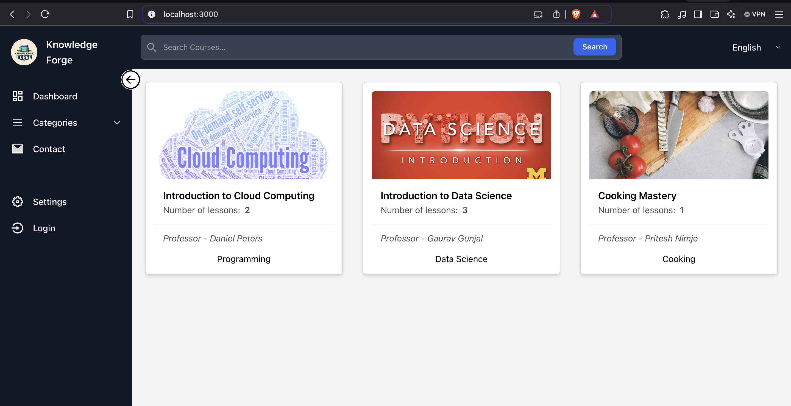

# KnowledgeForge

**KnowledgeForge** is an innovative online platform designed to seamlessly manage and deliver a wealth of educational resources. This comprehensive hub serves as a dynamic repository for courses, learning materials, and educational content, providing users with a centralized and intuitive interface to explore and enhance their knowledge.



## Technology Stack

- **Frontend**: React.js, TailwindCSS  
- **Backend**: Node.js, Express.js  
- **Database**: MongoDB  
- **API**: RESTful APIs

## Entity Relationship Diagram

Following is the Entity Relationship Diagram (ERD) of the project:


## Project Structure

The project is divided into two main folders:

### KnowledgeForge Server

This folder contains the backend of the application, built with **Node.js**, **Express**, and **MongoDB**. It handles the API endpoints, database operations, and user authentication.

### KnowledgeForge App

This folder contains the frontend of the application, built with **React.js** and styled with **TailwindCSS**. It handles the user interface, interactions, and communication with the backend server.

## Getting Started

### Prerequisites

- **Node.js** installed globally
- **MongoDB** installed and running locally (or use a cloud instance)

### Steps to Run the Server

1. **Set up Environment Variables**

   - In the `KnowledgeForge Server` directory, create a `.env` file.
   - Add necessary environment variables (e.g., database connection string, port number, API keys) by following the example provided in `.env.example`.

2. **Install Dependencies**

   ```bash
   cd KnowledgeForge_server
   npm install

## Team Members

- Gaurav Gunjal  
- Siddharth Dumbre  
- Vaibhav Gohil  
- Mit Sheth
